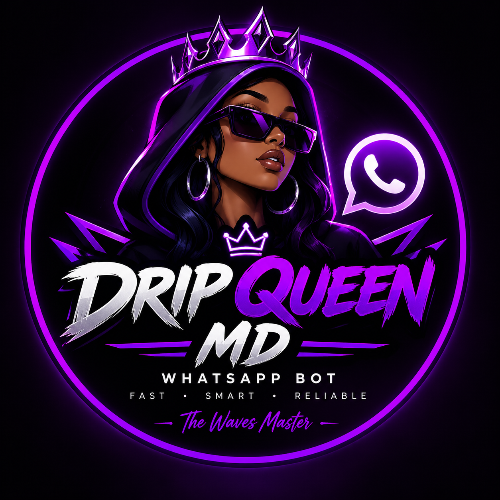
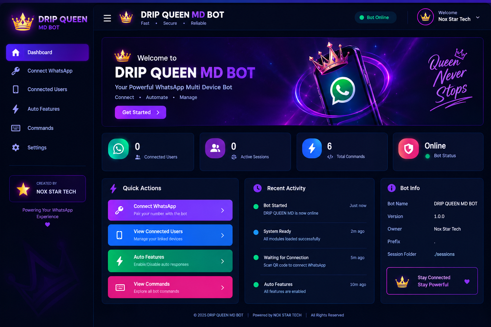

<div align="center">



# 👑 DRIP QUEEN MD

### ⚡ A Powerful Multi-Device WhatsApp Bot

<p>
  
  
  
</p>

<p>
  
  
  
</p>

<p>
  <b>Fast • Powerful • Modern • Multi-Session</b>
</p>


<br>


</div>

---

# 👋 About DRIP QUEEN MD

**DRIP QUEEN MD** is a modern **WhatsApp Multi-Device bot** built with **Node.js** and **Baileys**.

It is designed to provide a fast, powerful and customizable WhatsApp automation experience with support for:

* 📱 Multi-Device WhatsApp
* 🔗 Pairing Code Connection
* 👥 Multiple Sessions
* ⚡ Fast Commands
* 🎛️ Web Dashboard
* 🤖 Automatic Features
* 🔄 Automatic Reconnection
* 📂 Dynamic Command Loading
* ⚙️ Persistent Settings
* 🗄️ Session Management

> 👑 **DRIP QUEEN MD — More than a bot. It's a WhatsApp automation system.**

---

# ✨ Features

<table>
<tr>
<td width="50%">

### 📱 WhatsApp

* 🔗 Pairing Code
* 📱 Multi-Device Support
* 👥 Multi-Session
* 🟢 Always Online
* 🔄 Auto Reconnect

</td>

<td width="50%">

### ⚡ Automation

* 🤖 Auto Read
* ⌨️ Auto Typing
* 🎙️ Auto Recording
* ❤️ Auto React
* ⚡ Fast Responses

</td>
</tr>

<tr>
<td width="50%">

### 🎛️ Dashboard

* 🏠 Modern Dashboard
* 🔐 Pairing Management
* 👥 Session Management
* ⚙️ Feature Settings
* 📊 Bot Statistics

</td>

<td width="50%">

### 🧩 Developer

* 📂 Dynamic Commands
* 🗄️ Persistent Database
* ⚙️ Config System
* 🛡️ Error Handling
* 🚀 Easy Deployment

</td>
</tr>
</table>

---

# 🖥️ Dashboard

<div align="center">

### 🎛️ Modern • Responsive • Powerful

<!-- Replace this image with your actual dashboard screenshot -->



</div>

The dashboard provides a centralized interface for managing your bot.

### Dashboard sections

| Section     | Description                 |
| ----------- | --------------------------- |
| 🏠 Home     | Bot overview and statistics |
| 🔐 Pairing  | Connect WhatsApp accounts   |
| 👥 Sessions | Manage active sessions      |
| ⚡ Features  | Control automatic features  |
| 🧩 Commands | Browse available commands   |
| ⚙️ Settings | Manage bot configuration    |

---

# 📁 Project Structure

```text
DRIP-QUEEN-MD/
│
├── Commands/
│   ├── alive.js
│   ├── menu.js
│   ├── search.js
│   └── ...
│
├── assets/
│   ├── logo.png
│   └── dashboard.png
│
├── dashboard/
│   ├── index.html
│   ├── style.css
│   └── script.js
│
├── sessions/
│   └── .gitkeep
│
├── commandLoader.js
├── config.js
├── dashboard.js
├── database.js
├── functions.js
├── index.js
├── menuSession.js
├── newSession.js
├── session.js
├── sessionManager.js
├── settings.json
├── package.json
├── .gitignore
└── README.md
```

---

# 🛠️ Requirements

Before installing DRIP QUEEN MD, make sure you have:

* 🟢 Node.js 18+
* 📦 npm
* 📱 A WhatsApp account
* 🌐 Internet connection

Check Node.js:

```bash
node --version
```

Check npm:

```bash
npm --version
```

---

# 🚀 Installation

### 1️⃣ Clone the repository

```bash
git clone https://github.com/YOUR_USERNAME/DRIP-QUEEN-MD.git
```

### 2️⃣ Enter the project

```bash
cd DRIP-QUEEN-MD
```

### 3️⃣ Install dependencies

```bash
npm install
```

### 4️⃣ Start the bot

```bash
npm start
```

Or:

```bash
node index.js
```

---

# 🔐 Pairing Your WhatsApp

When the bot starts, open the dashboard.

Navigate to:

```text
Dashboard
      ↓
Pairing
      ↓
Enter WhatsApp Number
      ↓
Generate Pairing Code
      ↓
WhatsApp
      ↓
Linked Devices
      ↓
Link a Device
      ↓
Enter Pairing Code
```

🎉 Your WhatsApp account should now be connected.

---

# 📱 WhatsApp Commands

Commands are organized inside the:

```text
Commands/
```

directory.

Example:

| Command   | Description           |
| --------- | --------------------- |
| `.menu`   | Show bot menu         |
| `.alive`  | Check bot status      |
| `.search` | Search the web        |
| `.ping`   | Check response speed  |
| `.owner`  | Show bot owner        |
| `.help`   | Show help information |

> 🚧 More commands are being added continuously.

---

# ⚙️ Configuration

Bot settings can be customized through:

```text
config.js
```

Example:

```javascript
const config = {
    BOT_NAME: "DRIP QUEEN MD",
    BOT_VERSION: "1.0.0",
    CREATOR: "NOX STAR TECH"
};
```

You can also manage persistent feature settings through:

```text
settings.json
```

---

# 🧩 Dynamic Command System

DRIP QUEEN MD uses a dynamic command loader.

Instead of modifying the main `index.js` every time you create a command, simply add a new file inside:

```text
Commands/
```

Example:

```text
Commands/
├── alive.js
├── menu.js
├── search.js
├── ping.js
└── owner.js
```

The command loader automatically discovers available commands.

### Example command

```javascript
module.exports = {
    name: "alive",
    description: "Check bot status",
    category: "General",

    async execute(sock, msg) {
        await sock.sendMessage(
            msg.key.remoteJid,
            {
                text: "👑 DRIP QUEEN MD IS ALIVE!"
            },
            {
                quoted: msg
            }
        );
    }
};
```

---

# 🤖 Automatic Features

DRIP QUEEN MD supports configurable automatic features.

```text
🤖 Auto Read
⌨️ Auto Typing
🎙️ Auto Recording
❤️ Auto React
🟢 Always Online
🔄 Auto Reconnect
```

These features can be controlled through the dashboard.

---

# 👥 Multi-Session System

DRIP QUEEN MD is designed to support multiple WhatsApp sessions.

Each session can have its own:

* 🔐 Authentication state
* ⚙️ Settings
* 📱 WhatsApp connection
* 🗄️ Session data

Sessions are stored inside:

```text
sessions/
```

This allows multiple WhatsApp accounts to use the system without mixing authentication data.

---

# 🛡️ Stability

DRIP QUEEN MD is designed with stability in mind.

The system includes:

* 🔄 Automatic reconnection
* 🛡️ Command error handling
* 📂 Dynamic command loading
* 🗄️ Persistent settings
* 👥 Session isolation
* ⚡ Lightweight architecture

---

# 📦 Deployment

DRIP QUEEN MD can be deployed on platforms that support Node.js.

### 💻 Termux

```bash
pkg update
pkg upgrade

pkg install nodejs git

git clone https://github.com/YOUR_USERNAME/DRIP-QUEEN-MD.git

cd DRIP-QUEEN-MD

npm install

npm start
```

### ☁️ Render

A deployment configuration can be provided through:

```text
render.yaml
```

Set the required environment variables and deploy the Node.js service.

---

# 🧑‍💻 Developer

<div align="center">


### 👑 NOX STAR TECH

**Creator & Developer of DRIP QUEEN MD**

</div>

---

# 💜 Support

If you like **DRIP QUEEN MD**, consider supporting the project.

<div align="center">

⭐ Star the repository

🍴 Fork the project

🐛 Report bugs

💡 Suggest features

🤝 Contribute improvements

</div>

---

# ⚠️ Disclaimer

DRIP QUEEN MD is an independent WhatsApp automation project.

This project is **not affiliated with, endorsed by, or sponsored by WhatsApp or Meta Platforms, Inc.**

Use the bot responsibly and follow WhatsApp's terms and applicable laws.

---

# 📜 License

This project is licensed under the **MIT License**.

See:

```text
LICENSE
```

for more information.

---

<div align="center">


### 👑 DRIP QUEEN MD

**Made with 💜 by NOX STAR TECH**


<br>

**© 2026 NOX STAR TECH**

</div>
